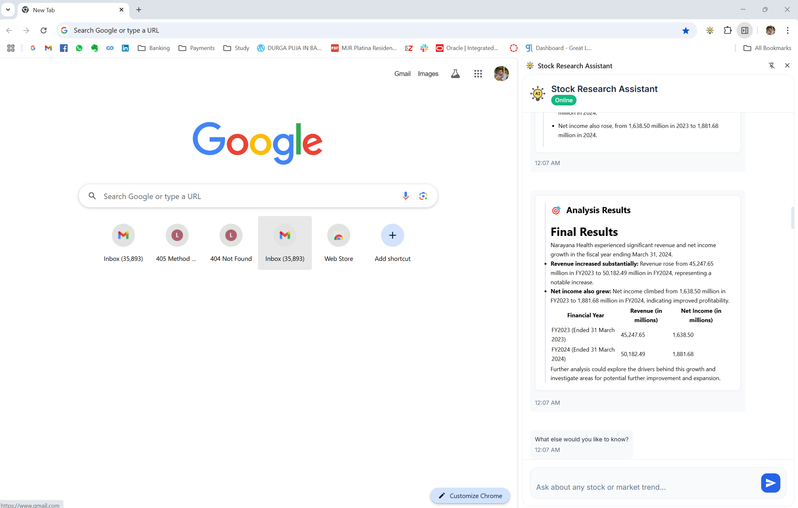

# Stock Research Assistant

An AI-powered stock research assistant that combines a Chrome extension interface with a powerful backend for real-time stock analysis and insights. This tool helps investors and analysts make informed decisions by providing AI-powered analysis of stocks and market data.



## Features

- **Chrome Extension Interface**: Convenient side panel for easy access
- **Document Search**: RAG (Retrieval-Augmented Generation) based search for relevant stock information
- **Interactive Queries**: Natural language processing for stock-related questions
- **Multi-Server Architecture**: Separate servers for RAG, Math operations, and Gmail integration
- **Live Updates**: Real-time progress during analysis
- **Comprehensive Analysis**: Multiple data points and insights in one place

## System Requirements

- Python 3.12 or higher
- UV package manager
- Google Chrome browser
- Ollama (for embeddings)
- Windows/Linux/MacOS
- Minimum 8GB RAM
- Stable internet connection

## Installation

### 1. Clone and Setup

```bash
# Clone the repository
git clone <repository-url>
cd stock-research

```

### 2. Ollama Setup

1. Install Ollama from [https://ollama.ai/](https://ollama.ai/)
2. Pull the required embedding model:
```bash
ollama pull nomic-embed-text
```

### 3. Environment Configuration
   ```bash
   # Create .env file with:
   GOOGLE_API_KEY=your_gemini_api_key_here
   ```

### 4. Gmail Configuration
   - Create `.google` directory in project root
   - Add Gmail API credentials in `.google/client_creds.json`
   - Configure app tokens in `.google/app_tokens.json`
   - Refer: https://github.com/jasonsum/gmail-mcp-server/blob/main/README.md

### 5. Chrome Extension Setup

1. Open Chrome and navigate to `chrome://extensions/`
2. Enable "Developer mode" in the top right
3. Click "Load unpacked" and select the `extension` directory from this project

## Architecture

### Backend Servers

1. **RAG Server**: Handles document search and retrieval
   - Uses FAISS for efficient vector search
   - Integrates with Ollama for embeddings
   - Processes and indexes documents for quick retrieval
   - Supports semantic search across documents

2. **Math Server**: Handles mathematical operations
   - Provides tools for financial calculations
   - Supports complex mathematical analysis
   - Handles statistical computations

3. **Gmail Server**: Email integration
   - Handles email-based notifications
   - Manages email communications
   - Supports automated reporting
   - Credit: https://github.com/jasonsum/gmail-mcp-server/blob/main/README.md

### Components

- **Message Broker**: Manages communication between components
- **Server Manager**: Handles server lifecycle and tool registration
- **User Interaction**: Manages real-time updates and user communication
- **Agent System**: Core AI processing and decision making

## Usage

### Starting the System

1. Start the backend server:
```bash
uv run main.py
```

2. Open the chrome extension
3. Click the extension icon to open the side panel

### Making Queries

- 

### Real-time Updates

- Progress indicators show analysis status
- Live updates as new information is processed
- Interactive results that can be expanded for details

## Project Structure

```
stock_research/
├── src/
│   └── stock_research/
│       ├── agent/          # Core agent functionality
│       │   ├── mcp_server/ # Server implementations
│       │   ├── llm/        # Language model integration
│       │   └── tools/      # Custom tools
│       ├── backend/        # Server and API endpoints
│       └── extension/      # Chrome extension files
├── main.py                 # Entry point
├── requirements.txt        # Python dependencies
└── pyproject.toml         # Project configuration
```

## Development

### Adding New Tools

1. Create a new tool in the appropriate server (RAG/Math/Gmail)
2. Register the tool using the `@mcp.tool()` decorator
3. Update the tool registry in the server manager

### Document Processing

Place documents in the `agent/mcp_server/rag/documents` directory. The system will automatically:
- Process new documents
- Generate embeddings
- Update the FAISS index


## Demo Video

[Coming Soon]

## License

[Your License]

## Contributing

[Contribution Guidelines]
